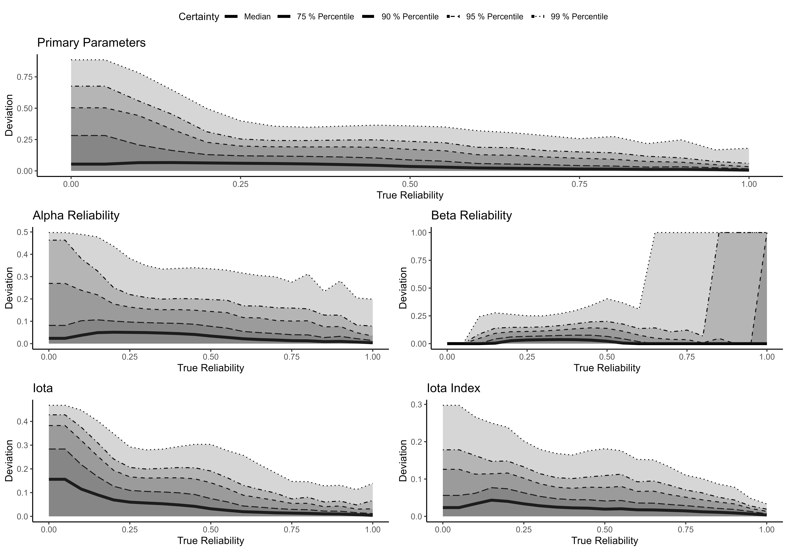
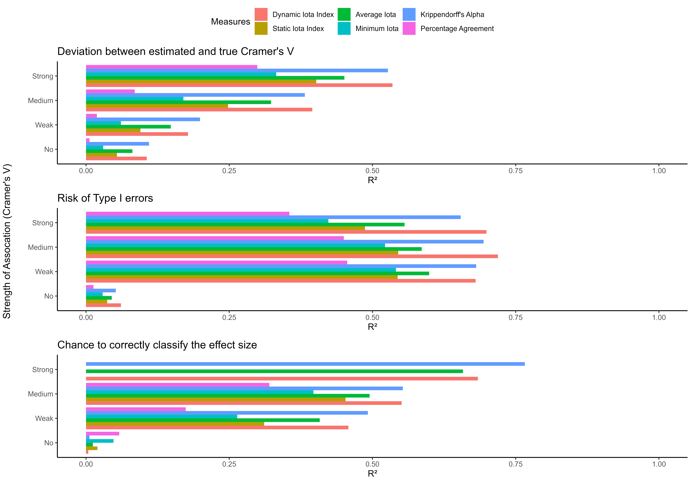
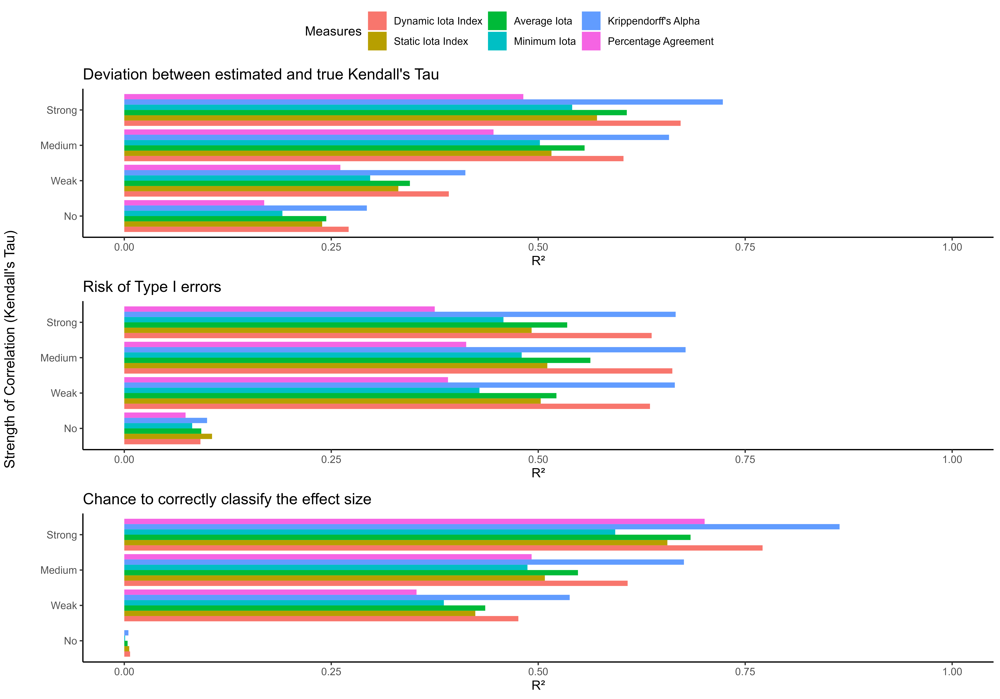

<!-- README.md is generated from README.Rmd. Please edit that file -->

# iotarelr - Iota Inter Coder Reliability for Content Analysis

*iotarelr* provides routines and tools for assessing the quality of
content analysis on the basis of the Iota Reliability Concept. The
concept is inspired of Item Response Theory and can be applied for any
kind of content analysis which uses a standardized coding scheme and
discrete categories. It is also applicable for content analysis
conducted by an artificial intelligence. The package provides
reliability measures for a complete scale as well as for every single
category. Analysis of subgroup invariance and error corrections are
implemented. This information can support the development process of a
coding scheme and allows a detailed inspection of the quality of data
generated.

The tools are able to provide answers to the following questions:

-   How reliable is a scale of a coding scheme? [Vignette: Get
    started](iotarelr.html)
-   How reliable is a single category within a scale? [Vignette: Get
    started](iotarelr.html)
-   Does the coding scheme works similar for different groups of
    materials or different groups of persons? [Vignette: Different
    Guidance Functioning](dgf.html)
-   How do codings error bias the generated data? [Vignette: Different
    Guidance Functioning](dgf.html)
-   How can the generated data corrected for errors? [Vignette: Error
    Correction](error_correction.html)

<!-- badges: start -->

[](https://cran.r-project.org/package=iotarelr)
[](https://cran.r-project.org/web/checks/check_results_iotarelr.html)
[](https://cran.r-project.org/package=iotarelr)
[](https://github.com/iotarelr)
[](https://www.repostatus.org/#active)
<!-- badges: end -->

## Introduction

A brief introduction in how to use the package can be found via [Get
started](iotarelr.html). Articles describing how to conduct advanced
analysis can be found via articles.

## Installation

You can install the development version of *iotarelr* from
[GitHub](https://github.com/) with:

``` r
# install.packages("devtools")
devtools::install_github("FBerding/iotarelr")
```

## Components

*iotarelr* calculates the following components of the *Iota Reliability
Concept*.

**On the level of every single category:**

-   ***Assignment Error Matrix:*** Matrix containing the probabilities
    to assign a coding unit truly belonging to category i to category j.
-   ***Alpha Reliability:*** Probability to assign a coding unit of
    category i to category i.
-   ***Beta Reliability:*** Probability to assign a coding unit of
    category j to category i.
-   ***Iota:*** Value ranging between 0 and 1 reflecting how well the
    generated data of category i really reflects category i.

**On the scale level:**

-   ***Iota Index:*** Measure for describing the reliability of a scale.
    Zero indicates the absence of reliability. One indicates perfect
    reliability.
-   ***Dynamic Iota Index:*** Transformation of the original *Iota
    Index* to account for the uncertainty of reliability estimation.
    Zero indicates the absence of reliability. One indicates perfect
    reliability.

## Accuracy of Reliability Estimates

Parameter estimation of the components makes use of Maximum Likelihood
Estimation (Expectation Maximization Algorithm) which comprises an
additional condition stage. The following Figure shows the extend to
which the estimated parameters correspond to their true values based on
a simulation study (Berding & Pargmann 2022). Click
[here](reference/figures/README-accuracy.png) to enlarge the Figure.

 In general the parameters
(Primary Parameters, Alpha and Beta Reliability) estimates do not
deviate more than 5 percentage points from their true values (see median
in the Figure). In most cases *Iota Index* deviates not more than .026
from its true value. The estimates are more accurate the greater the
sample size and the more raters are involved into coding. Furthermore,
the estimates are more accurate for higher values of true reliability.

## Predictive Power

Studies investigated the power of the Iota Concept for predicting the
quality of data generated by content analysis and compared the Iota
measures with other existing measures of inter coder reliability. The
Figure shows *R²* for nominal and ordinal data. To enlarge the Figure
for nominal data click
[here](reference/figures/README-pred_power_nominal.png).

In the case of nominal data *Dynamic Iota Index* performs similar as
*Krippendorff’s Alpha* or even better in predicting the deviation
between the estimated sample association and the true sample
association. Similar applies for estimating the risk of Type I errors
and the chance for correctly classifying the effect size into categories
proposed by Cohen (1988).

In the case of ordinal data *Dynamic Iota Index* shows a slightly
smaller performance as *Krippendorff’s Alpha* but the predictive power
of both measures is very high. To enlarge the Figure for ordinal data
click [here](reference/figures/README-pred_power_ordinal.png).

## Cut-Off Values

Iota Concept provides cut-off values for several measures on the scale
level. The following Table reports the currently recommended values.

| measure            | minimum | satisfactory | good  | excellent |
|:-------------------|:--------|:-------------|:------|:----------|
| Dynamic Iota Index | 0.829   | 0.961        | 0.985 | 1\*       |
| Static Iota Index  | 0.686   | 0.853        | 0.898 | 1\*       |
| Average Iota       | 0.693   | 0.847        | 0.875 | 1\*       |
| Minimum Iota       | 0.623   | 0.785        | 0.812 | 1\*       |

The *minimal* values imply the expectation that the estimated and true
association/correlation do not deviate more than 0.3. Furthermore, these
values justify the expectation that the risk of Type I errors is less
than 10 %.

The cut-off value for *satisfactory* justifies the expectation that the
estimated and true association/correlation do not deviate more than 0.1
and that the risk of Type I errors is less 5 %.

The values for *good* imply that the estimated and true
association/correlation do not deviate more than 0.3 with a certainty of
95 %. Furthermore, this values guarantees that the risk of Type I errors
is less 10 % with a certainty of 95 %.

Values of the category *excellent* ensure with a certainty of 95 % that
the risk of Type I errors is less 5 % and the deviation between
estimated and true sample association/correlation exceeds not more than
0.1. Please note that this degree of certainty is not completely reached
for the measures.

The presented cut-off values are only rules of thumb. They are derived
from the most reliability demanding situations. More situation specific
cut-off values can be calculated with the function `get_consequences()`.
Please refer to the vignette “Calculating consequences and cut-off
values”.

## Further Readings

-   Berding, Florian, Elisabeth Riebenbauer, Simone Stuetz, Heike
    Jahncke, Andreas Slopinski, and Karin Rebmann. 2022. Performance and
    Configuration of Artificial Intelligence in Educational
    Settings.Introducing a New Reliability Concept Based on Content
    Analysis. Frontiers in Education.
    <https://10.3389/feduc.2022.818365>
