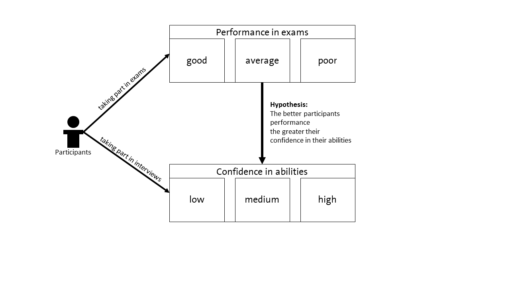

```{r, include = FALSE}
knitr::opts_chunk$set(
  collapse = TRUE,
  comment = "#>"
)
```
# 1 Introduction
In the first vignette [Get started](iotarelr.html) rules of thumbs are used
for evaluating the degree of reliability. In this vignette we would like to
show how a more situation specific evaluation of reliability is possible. In
doing this we continue the example of the first vignette which you can find 
[here](iotarelr.html). In the center of this kind of analysis stands the function 
`get_consequences()` which can be used for evaluating pretests of coding schemes, 
for planing or evaluating existing studies.

The cut-off values for judging reliability are derived in a way that they ensure
a high data quality in many practical situations. In the study of Berding and Pargmann (2022)
the most demanding situations are chosen. Thus, for some applications these 
rule of thumbs may be to strict. Additionally it may be helpful to understand 
which consequence are related with specific reliability values.

To illustrate this kind of analysis we need to extent our example by introducing
a new variable. Let's assume that all participants of the exam were interviewed 
in order to asses how confident
the students are about their abilities to successfully pass the exam. Let's further 
assume that the degree of confidence vary between "low", "medium" and "high".

In analogy to studies investigating the relationship between achievement and
self-concept (Huang 2011; Möller et al. 2020) we assume that participants with better exams have a higher 
confidence in their abilities. Figure 1 illustrates this relationship.

{width=100%}

To prove this relationship we use the data of the exams and the rated interviews.
If we can draw the right conclusion from the data depends on the reliability of
the generated data, the sample size and the sample method. This can be explored 
in more detail with the function `get_consequences()`

# 2 Using *get_consequences()*

The function `get_consequences()` provides information about the impact of reliability
on significance testing and drawing conclusions. It takes at least
four arguments. With `measure_typ` you can decide which measure of reliability 
on the scale level you would like to use. Currently we recommend to use 
`measure_typ = "dynamic_iota_index"` because in our analysis this measure showed the
highest value for *R²* in predicting different kinds of data quality.

With `measure_1_val` you can set the reliability of the independent variable. In our
example this is the performance a participant shows in his exam. Here the value for
*Dynamic Iota Index* is about .267 (see [Get started](iotarelr.html). With 
`measure_2_val` you can set the reliability of the depended variable. If this
value is not set explicitly the analysis assumes the same reliability as for the
independent variable. In our example the dependent variable refers to the data
of the interviews showing participants' confidence in their abilities. Let`s 
assume that the corresponding value of *Dynamic Iota Index* is about .879.

The argument `data_type` sets the scale level. Currently "nominal" and "ordinal"
are possible. In the case of nominal data all results of the function refer to
significant tests with *Cramer's V*. In the case of ordinal data all statistics
refer to significant tests with *Kendall's Tau*. In our example both scales
form an ordinal scale. 

The argument `strength` is close connected with the data type and refers to the
**true** strength of a relationship between independent and depended variable. The
argument can be set to "no", "weak", "medium" and "strong". These categories are
based on the work of Cohen (1988) who classified statistical measures according to
their relevance for real world applications. Thus,"no" does not mean a value for 
*Kendall's Tau* of 0 but a small value around 0. "Strong" does not mean a perfect
relationship, but values above 0.5. Cohen's (1988) work does not explicitly deal
with *Kendall's Tau* but with Persons Correlation. For *Cramer's V* the situation
is more complicated as the class of the effect size depends on the number of categories.
But this is considered in the function. In our example we assume a medium
relationship between performance and confidence.

The argument `sample_size` refers to the sample size of a planed 
or realized study. In our example three raters judged the written exams of 318
participants and analysed their corresponding interviews.

Finally `level` refers to the certainty level of the calculated prediction intervals. 
A prediction interval characterizes the probability that the true value is 
within a specific range around the prediction (Afifi et al. 2020, p. 119). In the 
current example we choose 95 %.

```{r calculation}
library(iotarelr)
get_consequences(measure_typ = "dynamic_iota_index",
                 measure_1_val = .267,
                 measure_2_val = .879,
                 data_type = "ordinal",
                 strength = "medium",
                 sample_size=318,
                 level = 0.95)
```

The function calculates three important aspects when investigating relationships.

**Deviation:** The first row called "deviation" characterizes the expected deviation between the
estimated sample effect size and the true sample effect size. Since we are using
ordinal data the effect size is  *Kendall's Tau*. The mean value implies that we
expect that *Kendall's Tau* differs from an error free assessment about .260 units.
This is quite high if we use Cohen's (1988) classification for Pearson Correlation. 
Here the meaning of a correlation changes every .20 units. The value for lower and
upper mean that with a certainty of 95 % the estimated value for *Kendall's Tau*
differs from an error free estimation between .107 and .413 units.

The column "practically no effect" reports the probability that the effect size does
not deviate more than 0.1 units. With a reliability of .267 for the exams and of
.879 for the interviews this chance is about 2 % which is very low. The last column
"practically weak effect" reports the probability that *Kendall's Tau* does deviate
less than 0.3 units from an error free measurement. This probability is about 70 %.
At first appearance this seems to be very high. However, this probability implies
that in nearly one third of all studies with the same research design the values
deviate more than 0.3 units.

**Classification rate:** The second row is close connected to deviation. It
describes the chance to correctly classify an effect size as practically not relevant,
as weak, medium or strong based on Cohens's (1988) classification. The mean value
implies that the chance to correct classify the effect size is about 0.9% which is very low.
The values for lower and upper state that with a certainty of 95 % the chance 
to correctly classify the effect size is between 0.2 and 2.8 %. Thus, it becomes 
clear that with the current reliability of .267 for the exams and .879 for 
the interviews the risk to draw the wrong conclusion about the strength of the
relationship is nearly certain.

The column "practically no effect" reports the probability that the chance to
correctly classify the effect size is at least 95 % while the last column reports
the probability to correctly classify the effect size is at least 90 %. In both
cases the probability is zero.

**Type I errors:** The last row refers to the risk of Type I errors. Type I errors
in this context mean that the significant test implies the acceptance of the null
hypothesis while an error free measurement would imply the rejection of the null hypothesis.
In other words: The results of the significant test implies that there is no relationship although
an error free measurement would imply the acceptance of a relationship.

The mean value implies that we have to expect a chance of 21.5 % of an Type I error.
That is, in 21.5 % of the cases the results of the significant tests imply that
there is no relationship between participants' performance in the exam and the
confidence in their abilities although an error free measurement would imply
the existence of such an relationship. The lower and the upper values imply that
with a certainty of 95 % the risk for Type I errors is between 6.4 % and 47.9 %.
Thus, there is a high risk for drawing the wrong conclusions.

The column "practically no effect" reports the probability that the risk of Type I
errors does not exceed 5 % while the last column reports the probability that
the risk of Type I errors does not exceed 10 %. In the current example the probability
for no relevant effect is about 1.1 % and for a weak effect about 9.5 %.

Summing up, the information provided by `get_consequences()` help to make the 
suggested cut-off values more concrete. The information can be used to judge
the degree of reliability more situation specific and can support the planing
of studies. 

# 3 Limitations
It is important to note that this analysis has some important limitations. First,
only two types of significance tests are supported (*Cramer's V* and *Kendall's Tau*).
Second, the analysis assumes that both independent and depend variables have
the same number of categories. Thus, please use the results as an orientation.

# References
- Afifi, A., May, S., Donatello, R. A. & Clark, V. A. (2020). Practical Multivariate Analysis (6th ed.). Chapman and Hall/
CRC Texts in Statistical Science Ser. CRC Press LLC. 
- Huang, C. (2011). Self-concept and academic achievement: a meta-analysis of 
longitudinal relations. Journal of school psychology, 49(5), 505–528. 
https://doi.org/10.1016/j.jsp.2011.07.001
- Cohen, J. (1988). Statistical Power Analysis for the Behavioral Sciences 
(2nd Ed.). Taylor & Francis.
- Möller, J., Zitzmann, S., Helm, F., Machts, N. & Wolff, F. (2020). 
A Meta-Analysis of Relations Between Achievement and Self-Concept. 
Review of Educational Research, 90(3), 376–419. 
https://doi.org/10.3102/0034654320919354


