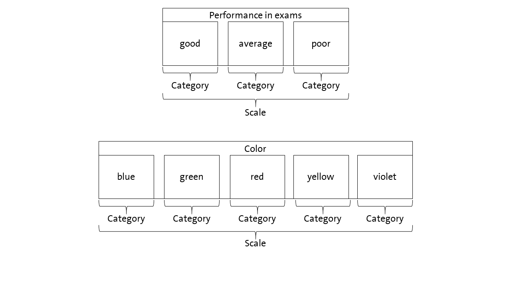
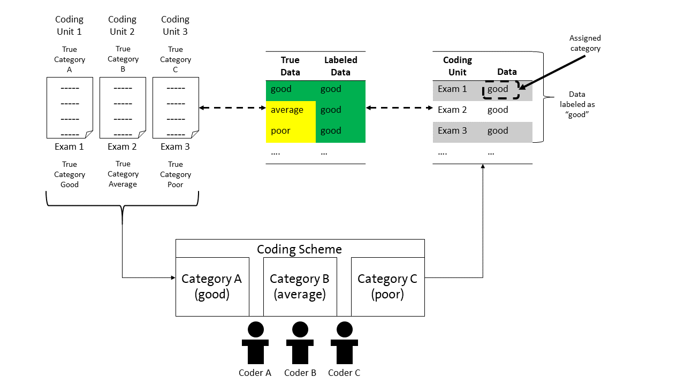
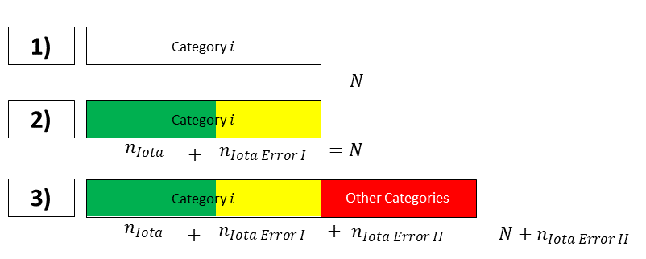

```{r, include = FALSE}
knitr::opts_chunk$set(
  collapse = TRUE,
  comment = "#>"
)
```
# 1 Introduction
*iotarelr* is a package for estimating the components of the Iota Reliability Concept.
The first version of this concept is described by Berding et al. (2022). The current
version is Iota2 (Berding & Pargmann 2022).

In this vignette, we describe how to use the package on the basis of the current 
version. We will show how to calculate and to interpret the basic
components. Advanced analyses are described with separate vignettes which you can
find via articles.

In order to use *iotarelr*, you need to load the package at the beginning of your
analysis.
```{r setup}
library(iotarelr)
```

In this introduction, we use a sample data set which is called "iotarelr_written_exams". 
The data set does not contain real data from written exams. It is a data set which 
was created for illustrating purposes only. Let us have a look at it.
```{r}
head(iotarelr_written_exams)
```
The data set contains four columns. The first three columns contain the ratings from
three coders. That is, every written essay is scored by three people. In terms 
of content analysis, three raters judged every essay, representing the coding units. 
An essay can be rated as "poor", "average" or "good". Thus, three categories are available.
The fourth column contains the gender of the person who wrote the essay. This column, however,
is not important at the moment. Such kinds of data can be used to analyze if the
codings work similarly across different groups of people or different groups of 
materials. This kind of analysis is described in the vignette [Different Guidance Functioning](dgf.html).
Keep in mind that at the moment, we are ignoring this column.

The *Iota Concept* provides measures which allow to inspect the reliability of single
categories as well as a complete scale. This is different from traditional measures
of reliability for content analysis, such as *Percentage Agreement*, *Cohen's Kappa* or
*Krippendorff's Alpha* which focus on the scale level only. Since in the literature of
content analysis, the terms "category", "scale" and "dimension" are used differently, it
is important to understand how the *Iota Concept* uses these terms. Figure 1 illustrates the understanding.

{width=100%}

Regarding our example, the performance in the exams is the scale which is made up
by three categories: "good", "average" and "poor". Since the categories can be
sorted by degree or performance, they form an ordinal scale. An example for
a nominal scale are colors. Here, the different colors are the categories. They
make up the scale "color".

It is very important to note that the *Iota Concept* differentiates between
two layers of data, which are shown in Figure 2.

{width=100%}

The coding units are the units to which a coding scheme is applied. In our example,
these are the exams. Each exam has a **true category**.
That is, an exam is good, average or poor. These categories make up the 
**true data**. However, the true categories are not inherently known. Thus, raters use a
coding scheme to decide about the category of a coding unit. In the example,
the raters have to judge if an exam is good, average or poor and assign the 
corresponding category to that coding unit/exam. All assignments make up the **labeled data**. 

However, it is not ensured that the assigned category is the same as the true category.
For example, in Figure 2, exam 1 is assigned to the category "good", which is also
the true category. Exam 2 is also assigned to the category "good", although in truth,
the exam represents an average exam. Alike applies to exam 3. The assigned category 
and true category should match, but this is not certain.

Since the assigned category and the true category may differ, the labeled data can vary
in the degree of how well it reflects the true data. That is, the degree of
overlapping between true data and labeled data can vary. In Figure 2, three exams
are assigned to be good exams. Thus, the data set contains three cases which are 
labeled as good exams. Although the cases
are labeled as good, only one case really is a good exam. Thus, the true data
and the labeled data for the category "good" overlap by 33%. For the category
"average", true data and labeled data overlap by 0% since there is one exam
that in truth is an average exam. However, there is no labeled data representing
this. Something similar applies for the category "poor".

The aim of reliability is to ensure that the **labeled data** matches the **true data**
as well as possible. To achieve this aim, the Iota Concept models the coding process
and provides measures for quantifying the degree of reliability as shown in the
following sections. 

# 2 Example for using the Iota Concept of the second generation
## 2.1 Estimation
The calculation of all components of Iota2 can be requested by using 
`compute_iota2()`. At this stage, it is crucial only to use the part of 
the data set which contains the codings. In every case, the coding units have to
be in the rows and the raters in the columns. We first save the codings in a new
object, request the estimation of Iota2 and save the results.
```{r}
codings<-iotarelr_written_exams[c("Coder A","Coder B","Coder C")]
res_iota2<-compute_iota2(data=codings,
                         random_starts = 5,
                         trace = FALSE)
```
The estimation of all components of Iota2 can take a moment. If you would like to 
see the progression, you can set `trace = TRUE`. After the estimation has finished,
we can request a summary with the function `get_summary()`.
```{r}
get_summary(res_iota2)
```
The summary first shows basic information such as the number of raters, the 
number of categories,the concrete categories and the number of coding units. 
Next, the summary presents the
log-likelihood which to some extent describes  the quality of the model. Lower
values imply a better fitting model than higher values. Additionally, the summary
prints whether or not the the best log-likelihood could be replicated. If this is not the case,
we recommend to increase the number of random starts and/or to investigate the
solutions to ensure that the subsequent analyses are based on the best model possible
.

## 2.2 Analysing the reliability on the categorical level
Next, the summary shows the results for the primary parameters. These are the
*Assignment Error Matrix* and the *categorical sizes*, which are the basis for all
other measures of the *Iota Concept*. 

The *Assignment Error Matrix* describes the rating process. The true category is
always in the rows and the assigned categories are always in the columns. In
the current example, the first row describes how exams representing an average
performance are assigned to the three different categories. An exam
representing an average performance is assigned as such an exam in about 91.7
of cases. In about 8.3% of cases, an average exam is assigned as a good
exam. Finally, an average exam is never assigned as a poor exam. Here, the corresponding
probability is about 0%.

When concentrating on the exams which reflect a good performance, the second row of
the *Assignment Error Matrix* is important. In about 49.3% of cases, a good
exam is assigned as a good exam. In other words: The probability to recognize a 
good exam as a good exam equals flipping a coin. In about 32.6% of cases, a good exam is assigned
to the category "average". That is, this exam is judged as showing an average performance, although it
is truly a good exam. Finally, a good exam is rated as a "poor" exam in about 18.1%
of the cases. Thus, the raters make more mistakes in evaluating a good exam than in
evaluating an average exam (49.3% for good exams compared to 91.7% for average
exams). 

The *categorical sizes* represent an estimate for the distribution of the **true** categories
in the population. In this example, we expect about 11.9% of all exams to be
average, 39.6% to be good and 48.5% to be poor.

Based on the *Assignment Error Matrix* and the *categorical sizes*, additional measures
of reliability can be derived. These are shown in the next lines of the summary.
The first is the *Alpha Reliability*, which correspondents to the diagonal of 
the *Assignment Error Matrix*. This determines the probability that a coding unit of a specific 
category is correctly assigned to that category. In this example, a coding unit truly
belonging to the category "average" is assigned to the category "average" in about 91.71%
of cases. In other words: An exam truly representing an average performance is
rated as an average exam in about 91.71% of cases. This value is quite high. 
In contrast, the *Alpha Reliability* of the category "good" is only .4933. This means 
that a coding unit truly belonging to the category "good" is assigned "good" only in
about 50% of cases. This is quite a bad result.
Alike applies for the category "poor".

The next row presents the *Beta Reliability*, representing
the probability that errors on **other** categories do **not** influence the category under 
investigation. In this example, the *Beta Reliability* of the category "average" 
is about .3718. This means that if a rater makes a mistake on the categories "good"
or "poor", the mistake is **not** assigned to the category "average" with a probability
of 37.18%. In other words: If a rater has to judge an exam which truly represents 
a good or poor performance and if the rater does not recognize the good or poor 
performance, they do **not** assign the exam to the category "average" with a probability of 37.18% .
Focusing on
the category "poor", the *Beta Reliability* is about .6596. This means: If a rater
has to judge an exam which truly reflects an average or a good performance and if
the rater does not recognize the good or average performance, they do **not** assign that
exam as poor in about 65.96 % of the cases. Thus, the *Beta Reliability* can be 
used to show how errors on the other categories influence the data generated 
for a specific category. The higher the values, the less influenced the data 
for that category. In this example, the category "average" is more influenced by
errors on both of the other categories than the categories "good" and "poor".

Finally, *Iota Reliability* combines the *Alpha* and the *Beta Reliability* by taking the
sizes of the categories into account. *Iota Reliability* is the core of the *Iota Concept*.
*Iota Reliability* is a measure that describes how well the data labeled as a specific category 
really reflects that category. It considers
three cases:

- all cases which are assigned to the correct category (*Iota*)
- all cases of that category which are not recovered (*Iota Error I*)
- all cases that are assigned to that category although they truly belong to 
another category (*Iota Error II*). 

Before we start to interpret these values for the case of the example, some additional explanations
are necessary. Figure 3 illustrates all three cases.

{width=100%}

Referring to the first row in Figure 3, the box represents all coding units that
**truly** belong to category *i*. In the case of perfect reliability, the **labeled data**
corresponds with these coding units. 

Row two in Figure 3 splits the coding units of that category. The green part of the box
represents the coding units, which in truth belong to category *i* and which are part
of the labeled data. The yellow part of the box represents the number of coding
units which in truth belong to category *i*, but which are not assigned to category *i*.
These coding units are missing in the labeled data. In the situation presented 
in row two, the total number of coding units representing category *i*
is underestimated with the labeled data. 

Let us now turn to the third row to provide a complete view. The 
**labeled data** of category *i* can also include coding units that **truly** belong
to **other** categories. These coding units are represented with the red box.
They are results from coding errors made in other categories and
increase the number of units labeled as category *i*, although in truth, they do not belong
to category *i*. Thus, these units contribute to an overestimation of 
the number of coding units truly belong to category *i*.

*Iota* refers to the green box of row 3, *Iota Error I* refers to the yellow box
and *Iota Error II* refers to the red box. All three measures are expressed as a
ratio on $N+n_{Iota Error II}$. 

With this in mind, we can now interpret the *Iota Reliability*. The easiest way is by
visualizing the values. This can be done with the function `plot_iota()`.

```{r, fig.height = 3, fig.width = 7.2, fig.align = "center", fig.cap="Figure 4: Example Plot of Iota"}
plot_iota(res_iota2)
```

***Category average:*** Let's start with the category "average". For this category, *Iota* is about .268.
This means that about 26.8% of the relevant labeled data really are average exams. 
The remaining 73.2% represent average exams that are missing in the results (*Iota Error I*) or
represent exams that truly belong to other categories (*Iota Error II*). With the help 
of the plot, both of these cases can be characterized in more detail. The yellow rectangle 
represents the average exams which are not part of the labeled data. The number 
.024 indicates that only a few exams
are "forgotten". The red rectangle describes the amount of exams that are part of 
the labeled data for the average exams, but which are in truth good or poor exams.
They made up about 70% of the labeled data. To sum up, the data representing the average
exams 

- recovers most of the exams that really are average exams (*Iota*).
- ignores only a small amount of exams which are really average exams (*Iota Error I*).
- is extremely biased by exams which in truth are good or poor (*Iota Error II*). Their
amount is greater than *Iota* and *Iota Error I* combined, indicating that the number of
coding units for average exams is extremely overestimated by the labeled data compared 
to the true data. 

Thus, although the category "average" is quite reliable, the low 
reliability of both of the other categories destroys the high quality of the part of 
data that should represent the average exams. 

***Category good:*** Turning to the category "good", *Iota* is about .387, implying that about 38.7%
of the data labeled as "good exams" really are good exams. However, nearly the 
same number of good exams are not represented in the data, as the yellow rectangle
in the plot shows. Thus, half of the good exams are missing in the labeled data.
$\frac{.398}{.387+.398}=.507$.
With a value of .215, only about 21.5% of the data is made up by
exams that truly represent an average or a poor performance. Thus, the data 
labeled as "good exams"

- only consists to about 39 % of exams which are in truth good exams (*Iota*).
- ignores about 50 % of the exams which are in truth good exams (*Iota Error I*).
- is weakly biased by exams that are in truth average or poor exams (*Iota Error II*).

In contrast to the data representing the average exams, the data representing the
good exams is not extremely biased by those from other categories, but ignores 
a high number of relevant ones. Thus, the labeled data underestimates the number
of truly good exams compared to the true data.

***Category poor:*** Finally, let's have a look at the category "poor". Here,
*Iota* is about .408, implying that the relevant data consist to 40.8% of the 
correct coding units/exams. However, *Iota Error I* is about .463, implying that
a high number of truly poor exams is not represented within the labeled data for
that category. *Iota Error II* is about .129 which is quite low, implying that about
12.9% of the relevant data is made up by coding units truly representing good or
average exams. Thus, the data representing the poor exams

- consists  of exams which are in truth poor exams only to about 40.8% (*Iota*).
- ignores about 53.2% of the exams which are in truth poor exams (*Iota Error I*).
- is weakly biased by exams that are in truth good or average exams (*Iota Error II*).

The number of poor exams is underestimated by the labeled data compared to the true data.

***Summary:*** To sum up, the sample coding scheme guiding the ratings of the exams requires a revision.
The data generated by the coding scheme is heavily biased in favor of 
average exams. The number of average exams is overestimated since a lot of good
and poor exams are treated as average exams. As a consequence, the number of good 
and poor exams is underestimated. Since the *Alpha Reliability* of the category
"average" is quite high, a revision should focus on the categories "good" 
and "poor". This revision should aim to provide more precise definitions and clearer
or more suitable examples that support raters in perceiving the true categories of the exams.

## 2.3 Analysing the reliability on the scale level
In many cases, not only the reliability of singles categories is important but
also the reliability of the complete scale. The *Iota Concept* provides several
measures for characterizing this kind of reliability. Currently, we recommend
to use the *Dynamic Iota Index*. This measure ranges from 0 to 1, 0 indicating
the absence of reliability, 1 indicating a perfect reliability. Referring
to the summary above, the *Dynamic Iota Index* is about .267. This is a low value
which replicates the analysis on the categorical level.

According to the the rules of thumb developed by Berding and Pargmann (2022), this
value is not sufficient to generate reliable data. The value should be at
least .829 to allow subsequent statistical analysis such as correlation analysis 
or significance testing. This is due to the fact that this degree of reliability leads to
high deviations from the true sample correlation and suffers from a high risk of
drawing wrong conclusions from statistical analyses.

# 3 Further readings
In this vignette, we presented the very basic usage of *Iota Concept*. If you would
like to lean more on the consequences of reliability on the scale level, we would
like to recommend the vignette 
[Estimating Consequences for Subsequent Analysis](cons_and_values.html). 
If you are interested in how the *Iota Concept* can be used to analyze if a coding
scheme performs similarly for different group of materials, we recommend the
vignette [Different Guidance Functioning](dgf.html).

As we are permanently working on improving *Iota Concept*, please check the
package's website for news.

For more details, we would like to refer to the following literature:

- Berding, Florian, Elisabeth Riebenbauer, Simone Stuetz, Heike Jahncke, Andreas Slopinski, and Karin Rebmann. 2022. Performance and Configuration of Artificial Intelligence in Educational Settings.Introducing a New Reliability Concept Based on Content Analysis. Frontiers in Education. https://10.3389/feduc.2022.818365


